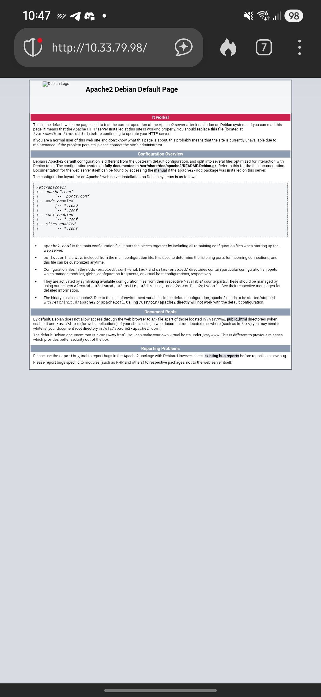

# 🧠 TP Réseau — Accès externe & Firewall Linux
## Rendu — Michaux Nicolas

## Phase 1 — VM accessible depuis l’extérieur (sans firewall)
### Architecture
- Hôte : wlan0 = 10.33.79.98/20, vboxnet0 = 192.168.56.1/24

- VM Web : 192.168.56.103/24 (Host-Only), service HTTP sur :80
### Règles hôte (nftables)
```bash
sudo nft add table ip nat 2>/dev/null || true
sudo nft 'add chain ip nat prerouting  { type nat hook prerouting  priority -100; }' 2>/dev/null || true
sudo nft 'add chain ip nat postrouting { type nat hook postrouting priority  100; }' 2>/dev/null || true
sudo nft 'add chain ip nat output      { type nat hook output      priority -100; }' 2>/dev/null || true

# Publier http://10.33.79.98 -> VM Web directe (192.168.56.103:80)
sudo nft 'add rule ip nat prerouting iif "wlan0" tcp dport 80 dnat to 192.168.56.103:80'
sudo nft 'add rule ip nat output ip daddr 10.33.79.98 tcp dport 80 dnat to 192.168.56.103:80'  # hairpin pour tester depuis l’hôte
sudo nft 'add rule ip nat postrouting oif "wlan0" ip saddr 192.168.56.0/24 masquerade'

sudo nft add table ip filter 2>/dev/null || true
sudo nft 'add chain ip filter forward { type filter hook forward priority 0; policy drop; }' 2>/dev/null || true
sudo nft 'add rule ip filter forward ct state established,related accept'
sudo nft 'add rule ip filter forward iif "wlan0"  oif "vboxnet0" ip daddr 192.168.56.103 tcp dport 80 ct state new accept'
sudo nft 'add rule ip filter forward iif "vboxnet0" oif "wlan0" ct state established,related accept'
```
### Test : depuis un autre poste sur le Wi-Fi → http://10.33.79.98/ ✅


## Phase 2 — Ajout d’un Firewall/Routeur entre Hôte et Web
### Nouvelle archi
```
[Hôte] → [VM Firewall] → [VM Web]
```
- Hôte : inchangé
- VM Firewall
    - enp0s3 (Host-Only) = 192.168.56.104/24 (WAN côté hôte)

    - enp0s8 (Internal int-lan) = 10.10.0.1/24 (LAN)

    - enp0s9 (NAT VBox) = 10.0.4.15/24, GW 10.0.4.2 (sortie Internet)
- VM Web : 10.10.0.10/24, GW 10.10.0.1

### Hôte (publier vers le firewall, plus vers la web directe)
```bash
sudo sysctl -w net.ipv4.ip_forward=1

# DNAT Wi-Fi -> WAN firewall
sudo nft 'flush chain ip nat prerouting'
sudo nft 'flush chain ip nat postrouting'
sudo nft 'flush chain ip nat output'
sudo nft 'flush chain ip filter forward'

sudo nft 'add rule ip nat prerouting iif "wlan0" tcp dport 80 dnat to 192.168.56.104:80'
sudo nft 'add rule ip nat output ip daddr 10.33.79.98 tcp dport 80 dnat to 192.168.56.104:80'
sudo nft 'add rule ip nat postrouting oif "wlan0" ip saddr 192.168.56.0/24 masquerade'

sudo nft 'add rule ip filter forward ct state established,related accept'
sudo nft 'add rule ip filter forward iif "wlan0"  oif "vboxnet0" ip daddr 192.168.56.104 tcp dport 80 ct state new accept'
sudo nft 'add rule ip filter forward iif "vboxnet0" oif "wlan0" ct state established,related accept'
```
### VM Web (réseau)
```bash
auto enp0s3
allow-hotplug enp0s3
iface enp0s3 inet static
  address 10.10.0.10/24
  gateway 10.10.0.1
  dns-nameservers 10.10.0.1 1.1.1.1
```
### VM Firewall (routage + NAT + filtrage)

```bash
# Routage
echo 1 > /proc/sys/net/ipv4/ip_forward
for i in all enp0s3 enp0s8 enp0s9; do echo 0 > /proc/sys/net/ipv4/conf/$i/rp_filter; done
ip route replace default via 10.0.4.2 dev enp0s9
ip route add 10.33.64.0/20 via 192.168.56.1 dev enp0s3   # retour vers les clients Wi-Fi

# NAT
nft add table ip nat 2>/dev/null || true
nft 'add chain ip nat prerouting  { type nat hook prerouting  priority -100; }' 2>/dev/null || true
nft 'add chain ip nat postrouting { type nat hook postrouting priority  100; }' 2>/dev/null || true

# DNAT : publier le web derrière le FW (HTTP, et HTTPS si besoin)
nft 'add rule ip nat prerouting iif "enp0s3" tcp dport 80  dnat to 10.10.0.10:80'
# nft 'add rule ip nat prerouting iif "enp0s3" tcp dport 443 dnat to 10.10.0.10:443'

# SNAT côté LAN : que le serveur voie la source = 10.10.0.1 (retour garanti)
nft 'add rule ip nat postrouting oif "enp0s8" ip daddr 10.10.0.10 tcp dport {80,443} snat to 10.10.0.1'

# (Internet sortant du LAN via la carte NAT VB)
nft 'add rule ip nat postrouting oif "enp0s9" ip saddr 10.10.0.0/24 masquerade'

# Filtrage FORWARD : n’autoriser que HTTP/HTTPS vers le Web
nft add table ip filter 2>/dev/null || true
nft 'add chain ip filter forward { type filter hook forward priority 0; policy drop; }' 2>/dev/null || true
nft 'add rule ip filter forward ct state established,related accept'
nft 'add rule ip filter forward iif "enp0s3" oif "enp0s8" ip daddr 10.10.0.10 tcp dport {80,443} ct state new accept'
nft 'add rule ip filter forward iif "enp0s8" oif "enp0s9" ct state new,established,related accept'
nft 'add rule ip filter forward iif "enp0s9" oif "enp0s8" ct state established,related accept'

# Bloquer le ping vers le firewall (durcissement INPUT)
nft 'add chain ip filter input { type filter hook input priority 0; policy accept; }' 2>/dev/null || true
nft 'insert rule ip filter input icmp type echo-request drop'

# Persistance
nft list ruleset > /etc/nftables.conf
systemctl enable --now nftables
```
### Test : depuis un autre poste sur le Wi-Fi → http://10.33.79.98/ ✅


## Phase 3 — Analyse & durcissement

### Traces & Preuve de passage par le Firewall
- tcpdump corrélés :
    - Hôte :
    ```bash
    sudo tcpdump -ni wlan0 tcp port 80
    sudo tcpdump -ni vboxnet0 host 192.168.56.104 and tcp port 80
    ```
    - Firewall :
    ```bash
    tcpdump -ni enp0s3 tcp port 80
    tcpdump -ni enp0s8 host 10.10.0.10 and tcp port 80
    ```


nft trace firewall 
```shell
root@lsblk2exa:/home/oui# nft monitor trace
trace id fe82fe1d inet trace preraw packet: iif "enp0s3" ether saddr 0a:00:27:00:00:00 ether daddr 08:00:27:0a:e3:fd ip saddr 10.33.72.197 ip daddr 192.168.56.104 ip dscp cs0 ip ecn not-ect ip ttl 63 ip id 58068 ip protocol tcp ip length 670 tcp sport 47082 tcp dport 80 tcp flags == 0x18 tcp window 71
trace id fe82fe1d inet trace preraw rule iif "enp0s3" tcp dport 80 meta nftrace set 1 (verdict continue)
...
```

route pour allée au serveur web : 
```shell
root@lsblk2exa:/home/oui# traceroute -n -T -p 80 10.10.0.10
traceroute to 10.10.0.10 (10.10.0.10), 30 hops max, 60 byte packets
 1  10.10.0.10  1.578 ms  1.630 ms  1.606 ms
 ```

pour eviter le bloquer le ssh j'ai bloqué les ping pour un exermple :
```bash 
avec le bloquage :
  ping -c2 192.168.56.104
PING 192.168.56.104 (192.168.56.104) 56(84) bytes of data.
64 bytes from 192.168.56.104: icmp_seq=1 ttl=64 time=0.300 ms
64 bytes from 192.168.56.104: icmp_seq=2 ttl=64 time=0.266 ms

--- 192.168.56.104 ping statistics ---
2 packets transmitted, 2 received, 0% packet loss, time 1007ms
rtt min/avg/max/mdev = 0.266/0.283/0.300/0.017 ms

regle appliqué au firewall :
```bash
nft add table ip filter 2>/dev/null || true
nft 'add chain ip filter input { type filter hook input priority 0; policy accept; }' 2>/dev/null || true
nft insert rule ip filter input icmp type echo-request drop


apres le bloquage :
  ping -c2 192.168.56.104
PING 192.168.56.104 (192.168.56.104) 56(84) bytes of data.
^C
--- 192.168.56.104 ping statistics ---
2 packets transmitted, 0 received, 100% packet loss, time 1044ms
```

 - Quelles commandes permettent de visualiser les compteurs de paquets ou les logs ?

 ```
 voir ce que je reçois sur l'hôte
 tcpdump  -ni wlan0 tcp port 80
 voir ce qui et envoie sur le firewall
 tcpdump -ni vboxnet0 host 192.168.56.104 and tcp port 80
 ```

- Comment tester un pare-feu (scan de ports, ping, curl, etc.) ?
```
curl pour voir si on peut accéder au site
exemple :
  curl -I http://192.168.56.104/

HTTP/1.1 200 OK
Server: nginx
Date: Tue, 21 Oct 2025 09:43:52 GMT
Content-Type: text/html
Content-Length: 10703
Last-Modified: Tue, 21 Oct 2025 07:20:39 GMT
Connection: keep-alive
ETag: "68f73447-29cf"
Accept-Ranges: bytes

ping pour tester la communication
```


- Phase 4 — Observation et rapport (BONUS)

- shéma  

- tableau
```
| Noeud    | Interface  | IP / Masque                      | Mode réseau                | Rôle                         |
| -------- | ---------- | -------------------------------- | -------------------------- | ---------------------------- |
| Hôte     | `wlan0`    | `10.33.79.98/20`                 | Wi-Fi (PEAP)               | Point d’entrée depuis le LAN |
| Hôte     | `vboxnet0` | `192.168.56.1/24`                | Host-Only                  | Lien vers VMs                |
| Firewall | `enp0s3`   | `192.168.56.104/24`              | Host-Only                  | WAN côté hôte                |
| Firewall | `enp0s8`   | `10.10.0.1/24`                   | Internal Network `int-lan` | LAN des VMs                  |
| Firewall | `enp0s9`   | `10.0.4.15/24` (GW `10.0.4.2`)   | NAT VirtualBox             | Sortie Internet              |
| Web      | `enp0s3`   | `10.10.0.10/24` (GW `10.10.0.1`) | Internal Network `int-lan` | Serveur Nginx                |
```
- port ouvert
```
root@lsblk2exa:/home/oui# ss -lntp
State        Recv-Q       Send-Q             Local Address:Port              Peer Address:Port       Process
LISTEN       0            128                      0.0.0.0:22                     0.0.0.0:*           users:(("sshd",pid=752,fd=6))
LISTEN       0            511                            *:80                           *:*           users:(("apache2",pid=759,fd=4),("apache2",pid=757,fd=4),("apache2",pid=756,fd=4))
LISTEN       0            128                         [::]:22                        [::]:*           users:(("sshd",pid=752,fd=7))
```
- indiquer les ports ouverts et leur fonction 
```bash
  ping -c2 192.168.56.104
...
--- 192.168.56.104 ping statistics ---
2 packets transmitted, 2 received, 0% packet loss, time 1007ms
rtt min/avg/max/mdev = 0.266/0.283/0.300/0.017 ms

root@lsblk2exa:/home/oui# ping 10.10.0.10
...
--- 10.10.0.10 ping statistics ---
2 packets transmitted, 2 received, 0% packet loss, time 1009ms
rtt min/avg/max/mdev = 0.723/1.009/1.296/0.286 ms
root@lsblk2exa:/home/oui# curl -I http://10.10.0.10/
HTTP/1.1 200 OK
...
  curl -I http://192.168.56.104/
HTTP/1.1 200 OK

  sudo tcpdump -ni vboxnet0 host 192.168.56.104 and tcp port 80
tcpdump: verbose output suppressed, use -v[v]... for full protocol decode
listening on vboxnet0, link-type EN10MB (Ethernet), snapshot length 262144 bytes
12:34:08.677267 IP 10.33.72.197.39578 > 192.168.56.104.80: Flags [S], seq 1487376968, win 65535, options [mss 1460,sackOK,TS val 198837030 ecr 0,nop,wscale 10], length 0

  sudo tcpdump -ni wlan0 tcp port 80
tcpdump: verbose output suppressed, use -v[v]... for full protocol decode
listening on wlan0, link-type EN10MB (Ethernet), snapshot length 262144 bytes
12:34:08.677184 IP 10.33.72.197.39578 > 10.33.79.98.80: Flags [S], seq 1487376968, win 65535, options [mss 1460,sackOK,TS val 198837030 ecr 0,nop,wscale 10], length 0

root@lsblk2exa:/home/oui# tcpdump -ni enp0s3 tcp port 80
tcpdump: verbose output suppressed, use -v[v]... for full protocol decode
listening on enp0s3, link-type EN10MB (Ethernet), snapshot length 262144 bytes
12:40:58.174467 IP 10.33.72.197.44134 > 192.168.56.104.80: Flags [R.], seq 623342953, ack 2407949979, win 68, options [nop,nop,TS val 199021500 ecr 3881317043], length 0
12:41:00.430364 IP 10.33.72.197.57014 > 192.168.56.104.80: Flags [S], seq 3533179016, win 65535, options [mss 1460,sackOK,TS val 199023736 ecr 0,nop,wscale 10], length 0
12:41:00.430996 IP 192.168.56.104.80 > 10.33.72.197.57014: Flags [S.], seq 2608760697, ack 3533179017, win 65160, options [mss 1460,sackOK,TS val 3881351066 ecr 199023736,nop,wscale 7], length 0

root@lsblk2exa:/home/oui# tcpdump -ni enp0s8 host 10.10.0.10 and tcp port 80
tcpdump: verbose output suppressed, use -v[v]... for full protocol decode
listening on enp0s8, link-type EN10MB (Ethernet), snapshot length 262144 bytes
12:41:30.638365 IP 10.10.0.1.57014 > 10.10.0.10.80: Flags [P.], seq 3533180081:3533180699, ack 2608761232, win 67, options [nop,nop,TS val 199030661 ecr 3881351161], length 618: HTTP: GET / HTTP/1.1
12:41:30.639321 IP 10.10.0.10.80 > 10.10.0.1.57014: Flags [P.], seq 1:175, ack 618, win 498, options [nop,nop,TS val 3881381274 ecr 199030661], length 174: HTTP: HTTP/1.1 304 Not Modified
12:41:30.650164 IP 10.10.0.1.57014 > 10.10.0.10.80: Flags [.], ack 175, win 68, options [nop,nop,TS val 199030757 ecr 3881381274], length 0

```


- extrait log 
```bash 
root@lsblk2exa:/home/oui# nft monitor trace
trace id fe82fe1d inet trace preraw packet: iif "enp0s3" ether saddr 0a:00:27:00:00:00 ether daddr 08:00:27:0a:e3:fd ip saddr 10.33.72.197 ip daddr 192.168.56.104 ip dscp cs0 ip ecn not-ect ip ttl 63 ip id 58068 ip protocol tcp ip length 670 tcp sport 47082 tcp dport 80 tcp flags == 0x18 tcp window 71
trace id fe82fe1d inet trace preraw rule iif "enp0s3" tcp dport 80 meta nftrace set 1 (verdict continue)
...
```

- proposer au moins une règle de sécurité ajoutée à la configuration (ex. blocage ping ou SSH).
```
autoriser que par cléf ssh
mettre en place en failtoban
systeme d'avertisment en ca de log suspecte
ajouter de la supervision pour regarder les perf du serveur en temps réel et plus simple pour analysé les log
```
